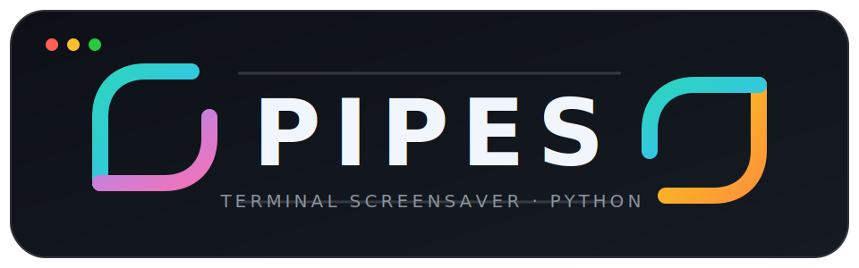

<div align="center">
  

  <p><strong>Animated terminal pipes. One Python file. Zero runtime dependencies.</strong></p>

  <p>
    <a href="https://github.com/xnixjoyer/Pipes/actions/workflows/cross-distro.yml"></a>
    <a href="https://github.com/xnixjoyer/Pipes/actions/workflows/nix.yml"></a>
    
    
  </p>

  <p>
    <a href="#quick-start">Quick start</a> ·
    <a href="#install">Install</a> ·
    <a href="#usage">Usage</a> ·
    <a href="#development">Development</a> ·
    <a href="#history-and-license">History</a>
  </p>
</div>

---

**Pipes** is an unofficial, independently maintained Python rewrite of the classic
[`pipes.sh`](https://github.com/pipeseroni/pipes.sh) terminal screensaver. It keeps
the familiar animation and controls while using a deterministic, testable model,
direct terminfo rendering, and reliable terminal cleanup.

The installed command is intentionally just:

```console
$ pipes
```

No `pipes.sh` executable alias is installed.

## Quick start

```bash
# Run directly from the checkout
python3 pipes_sh.py

# Nix
nix run github:xnixjoyer/Pipes

# After installing the wheel, Nix package, Arch package, or RPM
pipes
```

Press any unassigned key to exit.

## Highlights

- **Single-file runtime** — all application logic lives in `pipes_sh.py`.
- **No runtime subprocesses** — no shell, `tput`, `stty`, network access, or persistent writes.
- **Terminal-safe cleanup** — normal exit, signals, exceptions, and broken pipes restore the terminal.
- **Deterministic mode** — `--seed` makes model behavior reproducible.
- **Rich color support** — classic, 256-color, and direct-color indices through terminfo.
- **Ten built-in styles** — plus repeatable custom 16-glyph transition sets.
- **Cross-distribution packaging** — Python wheel, Nix, Arch Linux, and Fedora.
- **Real PTY coverage** — signals, resize, echo handling, and complete termios restoration are tested.

## Install

### Nix / NixOS

```bash
nix run github:xnixjoyer/Pipes
nix profile add github:xnixjoyer/Pipes
pipes --self-test
```

NixOS flake input:

```nix
{
  inputs.pipes.url = "github:xnixjoyer/Pipes";

  outputs = { nixpkgs, pipes, ... }: {
    nixosConfigurations.example = nixpkgs.lib.nixosSystem {
      system = "x86_64-linux";
      modules = [
        ({ pkgs, ... }: {
          environment.systemPackages = [
            pipes.packages.${pkgs.system}.default
          ];
        })
      ];
    };
  };
}
```

### Python wheel

```bash
python3 -m build --wheel --no-isolation
python3 -m pip install dist/*.whl
pipes --version
```

The distribution is named `pipes-sh-python`; the installed executable is `pipes`.

### Arch Linux

```bash
cd packaging/arch
makepkg --syncdeps --cleanbuild
sudo pacman -U ./pipes-sh-python-*.pkg.tar.zst
```

### Fedora

The RPM spec is located at:

```text
packaging/fedora/pipes-sh-python.spec
```

The CI workflow builds, inspects, installs, imports, and self-tests the generated RPM.

## Usage

```text
pipes [OPTION]...

-p [1-]               number of pipes
-t [0-9]              built-in pipe type; repeatable
-t c[16 chars]        custom pipe type; repeatable
-c [color index]      decimal color index; repeatable
-c #[hex]             hexadecimal color index; repeatable
-f [20-100]           frame rate
-s [5-15]             straight probability denominator
-r [0-]               clear after N drawn characters; 0 disables
-R                    random starting positions and directions
-B                    disable bold
-C                    disable color
-K                    keep color and type across edges
-h, --help            show help
-v, --version         show version
--self-test           run non-interactive integrity checks
--seed INTEGER        deterministic random seed
```

Examples:

```bash
pipes
pipes -p 8 -t 0 -t 8 -r 0
pipes -c 33 -c 39 -c 45 -p 3
pipes -t cMAYFORCEBWITHYOU --seed 42
```

### Keyboard controls

| Key | Action |
|:---:|---|
| `P` / `O` | Increase / decrease straight probability |
| `F` / `D` | Increase / decrease frame rate |
| `B` | Toggle bold immediately |
| `C` | Toggle color immediately |
| `K` | Toggle type/color retention across edges |
| any other key | Exit |

## Pipe styles

| Type | Style | Transition characters |
|---:|---|---|
| `0` | Heavy box | `┃┏ ┓┛━┓  ┗┃┛┗ ┏━` |
| `1` | Light arc | `│╭ ╮╯─╮  ╰│╯╰ ╭─` |
| `2` | Light square | `│┌ ┐┘─┐  └│┘└ ┌─` |
| `3` | Double box | `║╔ ╗╝═╗  ╚║╝╚ ╔═` |
| `4` | ASCII plus | `\|+ ++-+  +\|++ +-` |
| `5` | ASCII slash | `\|/ \\/-\\  \\|/\\ /-` |
| `6` | Dots | `.. ....  .... ..` |
| `7` | Dot / O | `.o oo.o  o.oo o.` |
| `8` | Railway | `-\\ /\\\|/  /-\\/ \\|` |
| `9` | Knobby | `╿┍ ┑┚╼┒  ┕╽┙┖ ┎╾` |

A custom type uses exactly 16 printable, single-cell Unicode codepoints:

```bash
pipes -t cMAYFORCEBWITHYOU
```

The transition index is `old_direction * 4 + new_direction`; reverse turns are
never generated.

## Architecture

The runtime stays in one physical module but is divided into explicit layers:

```text
CLI parsing → deterministic Engine → FrameResult → Renderer → terminal
```

- `Engine` owns movement, wrapping, random state, types, colors, and reset counts.
- `Renderer` converts immutable draw commands into one buffered write per frame.
- `TerminalSession` owns termios, signal handlers, alternate-screen state, and cleanup.
- `App` coordinates monotonic timing, input, resize, and rendering.

Detailed hand-off documentation for maintainers and coding agents starts at
[`ai-context/README.md`](ai-context/README.md).

## Development

```bash
nix develop
make test
python3 scripts/benchmark.py
python3 -m build --wheel --no-isolation
nix flake check
```

The test matrix covers Python 3.10 and 3.13, deterministic model runs, exact reset
ordering, wheel installation, PTY signal exits, resize to 1×1, echo disabling,
full termios restoration, Nix, unprivileged Arch packaging, and Fedora RPMs.

## Naming and versioning

- Public command: `pipes`
- Python module: `pipes_sh`
- Python / distro package: `pipes-sh-python`
- Nix app: `pipes`
- Man page: `pipes(6)`

Version **3.0.0** removes the old `pipes.sh` executable name. This is intentional:
the project has one clear command and does not install a compatibility alias.
Historical references to the original project remain credited as `pipes.sh`.

## History and license

The original program was created by
[Matthew Simpson](https://gist.github.com/msimpson/1096939), later developed by
[Yu-Jie Lin](https://github.com/livibetter), and maintained by the
[Pipeseroni/pipes.sh contributors](https://github.com/pipeseroni/pipes.sh/graphs/contributors).

This Python rewrite is independently maintained by
[xnixjoyer](https://github.com/xnixjoyer) and is **not** an official Pipeseroni
release.

The historical MIT license and copyright notices are preserved unchanged in
[`LICENSE`](LICENSE). The custom repository logo is part of this rewrite's
documentation and does not replace or reattribute the original project's history.
